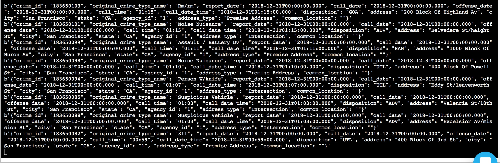

# Udacity-SF-Crime-Statistics-with-Spark-Streaming
# 1. Introduction
In this project, you will be provided with a real-world dataset, extracted from Kaggle, on San Francisco crime incidents, and you will provide statistical analyses of the data using Apache Spark Structured Streaming. You will draw on the skills and knowledge you've learned in this course to create a Kafka server to produce data, and ingest data through Spark Structured Streaming.

# 2. Run the project
## 1. Start by installing necessary libraries and packages

`./start.sh`

## 2. Start Zookeeper and your Kafka Server using the following commands:

`/usr/bin/zookeeper-server-start ./config/zookeeper.properties`

`/usr/bin/kafka-server-start ./config/server.properties`

## 3. Run the kafka_server.py to initialize the producer and the topic
`python kafka_server.py`

## 4. Test if topic creation was successful and topic is listed

`kafka-topics --list --zookeeper localhost:2181`

## 5. Run consumer_server.py to get consumed messages and check correctness or run kafka consumer in terminal with the following command

`kafka-console-consumer --bootstrap-server localhost:9092 --topic com.udacity.sfcrime.ly --from-beginning`

## 6.Run data_stream.py with the following command

`spark-submit --packages org.apache.spark:spark-sql-kafka-0-10_2.11:2.3.4 --master local[*] data_stream.py`

# 3. kafka consumer console output

# 4. Streaming progress reporter

# 5. Output

# 6. Spark UI

# 7. Respond to questions for successful project submission

How did changing values on the SparkSession property parameters affect the throughput and latency of the data?
`The smaller the number of InputRows, the more time is needed for each batch to be processed as it cost a decent 
amount of time to fetch the data and create the object header as well as the overhead. The more partitions and 
rows are available, the faster it gets to process the tasks/batches if parallelism is given. If respective 
partitions in Kafka has an uneven distribution of produced messages, it can also be helpful to rethink the 
distribution strategy.`

What were the 2-3 most efficient SparkSession property key/value pairs? Through testing multiple variations on values, how can you tell these were the most optimal?
`The most effective properties for a SparkSession for given tasks were maxOffsetsPerTrigger and maxRatePerPartition.
Based on the partitions configured, the number of maxRatePerPartition should not extend the maxOffsetsPerTrigger
(if multiplied with the partitions). The optimal rate was achieved with a rather large number of Offsets (ca. 2000)
and maxRatePerPartition of 1000.`
